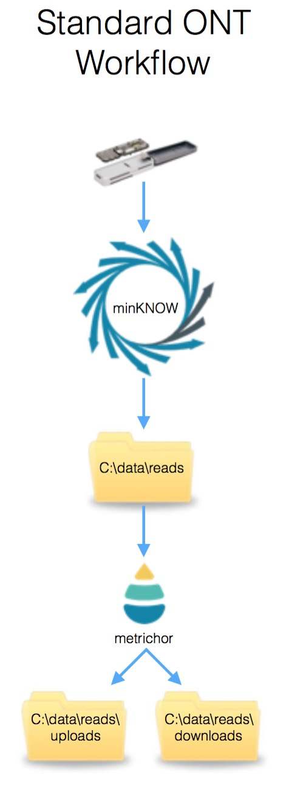
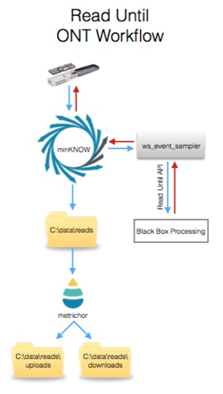

A full description of Read Until is available in the accompanying manuscript or from the Oxford Nanopore Technologies website.

In brief, Read Until enables the selective rejection of an individual read from the sequencing flow cell before that read has completed it's traversal through the pore. With long reads this can this can reduce the time taken to complete a sequencing experiment. Alternatively it could be used to exclude specific molecules from a sequencer.

To understand it's implementation, here is a figure showing the standard ONT sequencing workflow. Blue lines indicate the flow of event or base data through the pipeline.

Event data flows from the minION device under the control of the minKNOW software. These data are output as individual reads to a folder on the disk (Default - C:\data\reads). This folder is monitored by metrichor and the reads uploaded and base called. Metrichor moves non base called reads to a folder called "uploads" once they have been uploaded and writes the base called files to a folder called "downloads".

When running read until, an additional windows executable is run - ws_event_sampler. Event data are streamed from minKNOW via the ws_event_sampler program and made available to realtime processing scripts via the Read Until API. Event/Read data are again illustrated with blue arrows. Read rejection messages are passed via the Read Until API to ws_event_sampler and from there to minKNOW and the minION device itself to reject a read from a specific channel. 

