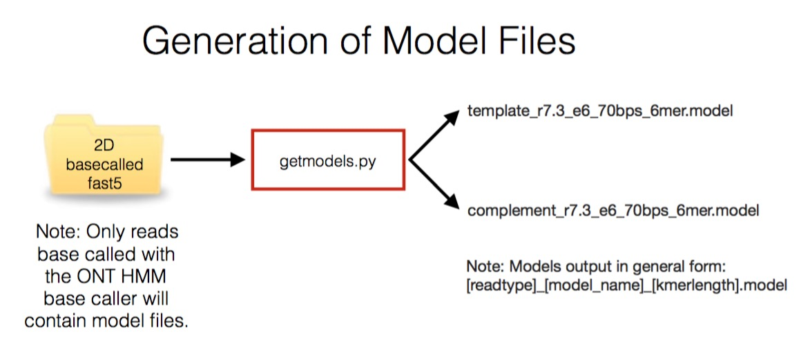

# getmodels.py

In order to squiggle match between an incoming read and a reference sequence it is necessary to generate a reference in squiggle space. To do this you require a model file to enable the conversion of kmers in base space to a current value. Currently the appropriate model files are embedded within reads as they are returned by the basecaller.

It is important to have a model file for the chemistry and pore type that you are using.

For read until you only require a template model file. If you wish to run ampbalance (which identifies potential 2D reads from a dataset you also require the complement model file).

It is not necessary to generate a model file each time you carry out a new read until experiment. Instead, new files should be obtained whenever a chemistry or pore change occurs. We suggest that it is good practice to extract a model file from the most recent read data available to you when preparing for a read until run as these models have been silently updated in the past.

Ideally the read from which to extract a model should come from the pass folder of a base called run. To extract both template and complement models, this read must be from a 2D base called run. getmodels.py will output whichever models it finds within the file.

Below is an image describing the function of getmodel.py :

First navigate to the RUscripts folder in a windows command terminal:

    > cd \path\to\RUscripts

To print the getmodels.py help statement at the prompt type:

    > python getmodels.py -h

which will output:

    usage: getmodels.py [-h] [-r READ] [-v] [-ver]

    getmodels: A program to extract model files from Nanopore reads. Ideally you
    should provide a read that has given a 2D read - i.e comes from the pass
    folder on a 2D basecalling run. For Read Until purposes, extraction of just a
    template model is sufficient. Model files will be appended with a number to
    identify the kmer length of the model.

    optional arguments:
    -h, --help            show this help message and exit
    -r READ, --read READ  Provide a read file to extract the current model from.
    -v, --verbose-true    Print detailed messages while processing files to aid
                        in debugging.
    -ver, --version       Print version information and exit.

To run getmodels.py at the prompt ($) type:

    $python getmodels.py -r /path/to/your/read.fast5

We provide a suitable read in the folder exampleread

So:

    > python getmodels.py -r exampleread/llssbzms2p35x_lambda11ladderup_1208_1_ch11_file27_strand.fast5

will output:

    Processing exampleread/llssbzms2p35x_lambda11ladderup_1208_1_ch11_file27_strand.fast5
    Looking for template model.
    ***: Model Found
    template model file write completed.
    Kmer length is: 6
    File format is:
    Kmer	Mean	Standard Dev
    Looking for complement model.
    ***: Model Found
    complement model file write completed.
    Kmer length is: 6
    File format is:
    Kmer	Mean	Standard Dev

This will have generated two files - one for the template and one for the complement model.

They will be named:

[readtype]_[model_name]_[kmerlength].model

Where [readtype] is either template or complement, [model_name] is the pore/chemistry type (in this case r7.3_e6_70bps_6mer) and [kmerlen] is the locally calculated length of the kmers used in the model.

These model files are used by all other scripts here. Note that the model files will be overwritten by getmodels.py if it is run again on another read with the same pore/chemistry type and kmer length. This is not a problem.

*** We recommend that you update the model regularly.
