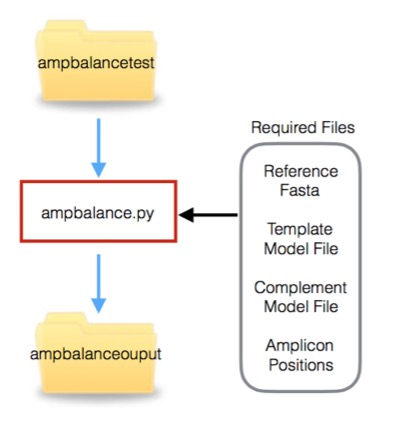
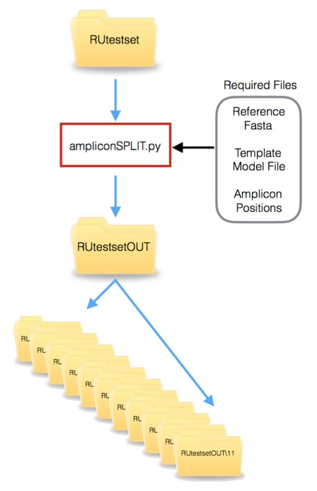
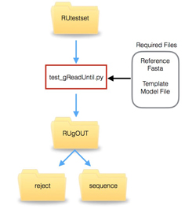

# Running Offline Read Until Scripts

# ampbalance.py

Ampbalance is a script which will map entire 2D reads to a reference sequence, identify those likely to give a good 2D read by determining if the template and complement reads overlap with one another appropriately and subsequently copy a defined number of those reads up to a specific depth into a folder for further analysis. This script was originally written to facilitate the sequencing and analysis of Ebola virus and to simplify the transfer of read data prior to base calling where network bandwidth was limited (see Quick, J., Loman, N. J., Duraffour, S., Simpson, J. T. & Severi, E. Real-time, portable genome sequencing for Ebola Surveillance. Nature, doi:10.1038/nature16996 (2016).)

Unlike read until applications this script uses the entire read and so requires both the template and complement models.

The image below illustrates how it works. Note that event data flow along blue lines.

Here the script is implemented on reads that have been basecalled to facilitate testing and comparisons.

First navigate to the RUscripts folder in a windows command terminal:

    > cd \path\to\RUscripts

To print the ampbalance.py help statement at the prompt ($) type:

    > python ampbalance.py -h

which will output:

    usage: ampbalance.py [-h] -fasta FASTA -ids IDS -w WATCHDIR -o TARGETPATH -d
                         DEPTH -procs PROCS [-cautious] [-l LENGTH] -t TEMP_MODEL
                         -c COMP_MODEL [-v] [-ver]

    ampbalance: A program designed to balance amplicons from a specific reference
    sequence post sequencing on ONT minIONs but prebasecalling. Developed by Matt
    Loose @mattloose or matt.loose@nottingham.ac.uk for help! Args that start with
    '--' (eg. --reference_fasta_file) can also be set in a config file
    (/path/to/your/script/amp.config or ) by using .ini or
    .yaml-style syntax (eg. reference_fasta_file=value). If an arg is specified in
    more than one place, then command-line values override config file values
    which override defaults.

    optional arguments:
      -h, --help            show this help message and exit
      -fasta FASTA, --reference_fasta_file FASTA
                            The fasta format file for the reference sequence for
                            your organism.
      -ids IDS, --reference_amplicon_positions IDS
                            A file containing a list of amplicon positions defined
                            for the reference sequence. 1 amplicon per line in the
                            format fasta_sequence_name:start-stop e.g
                            J02459:27-1938
      -w WATCHDIR, --watch-dir WATCHDIR
                            The path to the folder containing the downloads
                            directory with fast5 reads to analyse - e.g.
                            C:\data\minion\downloads (for windows).
      -o TARGETPATH, --output-dir TARGETPATH
                            The path to the destination folder for the
                            preprocessed reads
      -d DEPTH, --depth DEPTH
                            The desired coverage depth for each amplicon. Note
                            this is unlikely to be achieved for each amplicon and
                            should probably be an overestimate of the minimum
                            coverage required.
      -procs PROCS, --proc_num PROCS
                            The number of processors to run this on.
      -cautious, --cautious
                            DTW of long reads on low memory systems can cause
                            unexpected crashes. This option will prevent automatic
                            skipping on any reads over 10,000 events. You can
                            optionally increase this length with the -l parameter.
                            USE WITH CAUTION AS THIS MAY CAUSE A SYSTEM TO CRASH.
      -l LENGTH, --length LENGTH
                            A limit on the length of read that ampbalance will
                            attempt to align using DTW - Long reads can cause
                            problems on low memory systems
      -t TEMP_MODEL, --template_model TEMP_MODEL
                            The appropriate template model file to use
      -c COMP_MODEL, --complement_model COMP_MODEL
                            The appropriate complement model file to use
      -v, --verbose-true    Print detailed messages while processing files.
      -ver, --version       show program's version number and exit

This script is designed to match amplicon sequences of known and approximately uniform length to a reference sequence. The reference sequence should be a single sequence.

We provide an example set of reads using lambda, found in the ampbalancetest folder. A typical usage command would be:

    > python ampbalance.py -fasta J02459.fasta -ids lambda_amplicons.txt -w ampbalancetest -o ampbalanceoutput -d 5 -procs 4 -t template_r7.3_e6_70bps_6mer_6.model -c complement_r7.3_e6_70bps_6mer_6.model -l 3000

This will output the following:

    Reading amplicons
    ******AMP DICTIONARY*******
    <type 'dict'>
    {1: 52, 2: 2065, 3: 4070, 4: 6059, 5: 8012, 6: 10008, 7: 12006, 8: 14011, 9: 16076, 10: 18022, 11: 20053}
    {'DO': 0, 1: 0, 2: 0, 3: 0, 4: 0, 5: 0, 6: 0, 7: 0, 8: 0, 9: 0, 10: 0, 11: 0, 'BF': 0, 'HF': 0, 'NH': 0}
    Now we are going to try and open the raw reads and do the same as we have done above...
    {'DO': 0, 1: 0, 2: 0, 3: 1, 4: 0, 5: 0, 6: 0, 7: 0, 8: 0, 9: 0, 10: 0, 11: 0, 'BF': 0, 'TF': 109, 'HF': 4, 'NH': 0}
    {'DO': 0, 1: 0, 2: 0, 3: 1, 4: 0, 5: 0, 6: 0, 7: 1, 8: 0, 9: 0, 10: 0, 11: 0, 'BF': 0, 'TF': 108, 'HF': 5, 'NH': 0}
    .
    . (many more lines here)
    .
    {'DO': 0, 1: 10, 2: 10, 3: 10, 4: 10, 5: 9, 6: 10, 7: 10, 8: 10, 9: 10, 10: 10, 11: 10, 'BF': 0, 'TF': 1, 'HF': 110, 'NH': 0}
    {'DO': 0, 1: 10, 2: 10, 3: 10, 4: 10, 5: 10, 6: 10, 7: 10, 8: 10, 9: 10, 10: 10, 11: 10, 'BF': 0, 'TF': 0, 'HF': 110, 'NH': 0}
    Amplicon Read Counts
    Amplicon Number: 1 Reads: 10
    Amplicon Number: 2 Reads: 10
    Amplicon Number: 3 Reads: 10
    Amplicon Number: 4 Reads: 10
    Amplicon Number: 5 Reads: 10
    Amplicon Number: 6 Reads: 10
    Amplicon Number: 7 Reads: 10
    Amplicon Number: 8 Reads: 10
    Amplicon Number: 9 Reads: 10
    Amplicon Number: 10 Reads: 10
    Amplicon Number: 11 Reads: 10
    Copying Amplicon Data
    Amplicon Number 1
    Amplicon Number 2
    Amplicon Number 3
    Amplicon Number 4
    Amplicon Number 5
    Amplicon Number 6
    Amplicon Number 7
    Amplicon Number 8
    Amplicon Number 9
    Amplicon Number 10
    Amplicon Number 11

Key:
DO: Template and Complement Strands don't overlap on amplicons as expected. Read Discarded. Unlikely to generate good 2D.
1...11: Amplicon numbers followed by current coverage counts satisfying highest stringency tests.
BF: Bad Files - these files contain more events than the -length threshold. They are unlikely to be of interest in an amplicon run and are skipped unless the -cautious flag is set.
TF: Total Files - this counts down the number of files left to process.
HF: Hairpin Found - this is the number of reads containing a hairpin - these are tested.
NH: No Hairpin - these reads are ignored as no hairpin has been found.

This program will output files to the specified output directory. Files which are already basecalled will be written to a subfolder called "Downloads". Raw files will just be written to the specified output directory.

Note that the example read set here has been preselected to contain 10 reads mapping to each amplicon and all the reads are 2D - thus the HF value is 110 and the DO value is 0.

It is also important to note that this script uses the hairpin_found flag in the read files. Since minKNOW version 0.51.1.62 (released February 22nd 2016) the writing of this flag to read files has been problematic. Thus reads generated with this version of minKNOW may appear to have far fewer 2D reads than they really do.

# ampliconSPLIT.py

ampliconSPLIT.py simulates read until on either raw or basecalled reads. It ignores the first 50 events of a read and matches the subsequent 250 events against a reference squiggle. Read until only ever processes template data and so only a template model is required.

The ampliconSPLIT workflow is illustrated below. Note that unlike ampbalance, ampliconSPLIT will separate read files into a directory per amplicon.

This script will process reads into subfolders in the targetpath corresponding to each amplicon described in the -ids file - e.g /targetpath/{amplicon_number}. If the read is basecalled, it will be placed in a downloads subfolder - e.g /targetpath/{amplicon_number}/downloads .

First navigate to the RUscripts folder in a windows command terminal:

    > cd \path\to\RUscripts

To print the ampliconSPLIT.py help statement at the prompt ($) type:

    > python ampliconSPLIT.py -h

which will output:

    usage: ampliconSPLIT.py [-h] -fasta FASTA -ids IDS -w WATCHDIR -o TARGETPATH
                        -d DEPTH -procs PROCS -t TEMP_MODEL [-v] [-ver]

    ampliconSPLIT: A program designed to identify and group individual amplicons
    from minION reads prior to base calling. The depth setting limits the number
    of reads copied to each sub folder. Developed by Matt Loose @mattloose or
    matt.loose@nottingham.ac.uk for help! Args that start with '--' (eg.
    --reference_fasta_file) can also be set in a config file
    (/Users/mattloose/fixes/RUscripts/UPDATES/amp.config or ) by using .ini or
    .yaml-style syntax (eg. reference_fasta_file=value). If an arg is specified in
    more than one place, then command-line values override config file values
    which override defaults.

    optional arguments:
    -h, --help            show this help message and exit
    -fasta FASTA, --reference_fasta_file FASTA
                        The fasta format file for the reference sequence for
                        your organism.
    -ids IDS, --reference_amplicon_positions IDS
                        A file containing a list of amplicon positions defined
                        for the reference sequence. 1 amplicon per line in the
                        format fasta_sequence_name:start-stop e.g
                        EM_079517:27-1938
    -w WATCHDIR, --watch-dir WATCHDIR
                        The path to the folder containing the downloads
                        directory with fast5 reads to analyse - e.g.
                        C:\data\minion\downloads (for windows).
    -o TARGETPATH, --output-dir TARGETPATH
                        The path to the destination folder for the
                        preprocessed reads
    -d DEPTH, --depth DEPTH
                        The desired coverage depth for each amplicon. Note
                        this is unlikely to be achieved for each amplicon and
                        should probably be an overestimate of the minimum
                        coverage required.
    -procs PROCS, --proc_num PROCS
                        The number of processors to run this on.
    -t TEMP_MODEL, --template_model TEMP_MODEL
                        The appropriate template model file to use. This file
                        can be generated uing the getmodels.py script.
    -v, --verbose-true    Print detailed messages while processing files.
    -ver, --version       show program's version number and exit

An example run command using test data:

    > python ampliconSPLIT.py -fasta J02459.fasta -ids lambda_amplicons.txt -w RUtestset/ -o test -d 10 -procs 8 -t template_r7.3_e6_70bps_6mer_6.model

Which will output:

    processing the reference fasta.
    ID J02459
    length 48502
    FORWARD STRAND
    REVERSE STRAND
    Groking amplicons
    ******AMP DICTIONARY*******
    <type 'dict'>
    {1: 52, 2: 2065, 3: 4070, 4: 6059, 5: 8012, 6: 10008, 7: 12006, 8: 14011, 9: 16076, 10: 18022, 11: 20053}
    {'DO': 0, 1: 0, 2: 0, 3: 0, 4: 0, 5: 0, 6: 0, 7: 0, 8: 0, 9: 0, 10: 0, 11: 0, 'BF': 0, 'HF': 0, 'NH': 0}
    We want to build a custom reference that is smaller than the original reference.
    First get a list of all the positions we will need to search
    Generating a custom fasta
    J02459
    processing the custom fasta
    Attempting to match reads and split into folders based on 250 events, excluding the first 50.
    Amplicon Read Counts
        Amplicon Number: 1 Reads: 4
        Amplicon Number: 2 Reads: 5
        Amplicon Number: 3 Reads: 4
        Amplicon Number: 4 Reads: 5
        Amplicon Number: 5 Reads: 6
        Amplicon Number: 6 Reads: 6
        Amplicon Number: 7 Reads: 5
        Amplicon Number: 8 Reads: 5
        Amplicon Number: 9 Reads: 5
        Amplicon Number: 10 Reads: 5
        Amplicon Number: 11 Reads: 5
    Copying Amplicon Data
    Amplicon Number 1
    Amplicon Number 2
    Amplicon Number 3
    Amplicon Number 4
    Amplicon Number 5
    Amplicon Number 6
    Amplicon Number 7
    Amplicon Number 8
    Amplicon Number 9
    Amplicon Number 10
    Amplicon Number 11

The depth parameter (-d) sets the number of reads that will be copied. Setting this to a value greater than the number of reads analysed will sort all reads in the dataset.

# test_gReadUntil.py

*** Note this script is located with the ReadUntil folder of this repository

This script runs entirely independently of the read until API and allows for simulation of selective sequencing of a genome. You can provide a pool of reads and the script will use the first 250 events to map a read and copy those mapping within the desired area to a specified folder.

A schematic of the workflow is provided below:

First navigate to the ReadUntil folder within the RUscripts folder in a windows command terminal:

    > cd \path\to\RUscripts\ReadUntil

Help is available by typing:

    > python test_gReadUntil.py -h

which will output:

    usage: test_gReadUntil.py [-h] -fasta FASTA -targets [TARGETS [TARGETS ...]]
                          -procs PROCS -m TEMP_MODEL [-log LOGFILE] -w
                          WATCHDIR [-o OUTPUT_FOLDER] [-v] [-ver]

    real_read_until: A program providing read until with the Oxford Nanopore
    minION device. This program will ultimately be driven by minoTour to enable
    selective remote sequencing. This program is heavily based on original code
    generously provided by Oxford Nanopore Technologies.

    optional arguments:
    -h, --help            show this help message and exit
    -fasta FASTA, --reference_fasta_file FASTA
                        The fasta format file describing the reference
                        sequence for your organism.
    -targets [TARGETS [TARGETS ...]]
                        Positional IDs to enrich for in the form seqid:start-
                        stop . Can be space seperated eg: J02459:10000-15000
                        J02459:35000-40000
    -procs PROCS, --proc_num PROCS
                        The number of processors to run this on.
    -m TEMP_MODEL, --model TEMP_MODEL
                        The appropriate template model file to use
    -log LOGFILE, --log-file LOGFILE
                        The name of the log file that data will be written to
                        regarding the decision made by this program to process
                        read until.
    -w WATCHDIR, --watch-dir WATCHDIR
                        The path to the folder containing the downloads
                        directory with fast5 reads to analyse - e.g.
                        C:\data\minion\downloads (for windows).
    -o OUTPUT_FOLDER, --output OUTPUT_FOLDER
                        Path to a folder to symbolically place reads
                        representing match and not match.
    -v, --verbose-true    Print detailed messages while processing files.
    -ver, --version       show program's version number and exit

A typical command line to select reads mapping from 10-15kb in the lambda genome would be:

    > python test_gReadUntil.py -fasta ../J02459.fasta -targets J02459:10000-15000 -procs 4  -m ../template_r7.3_e6_70bps_6mer_6.model -w ../RUtestset/ -o RUgOUT

This would give the following output:

    ***********************************************************************************************
    **** This code will open a collection of reads and simulate read until on them. It will    ****
    **** copy reads into a secondary folder for subsequent processing by another analysis      ****
    **** package.                                                                              ****
    ***********************************************************************************************
    processing the reference fasta.
    J02459:10000-15000
    ID J02459
    length 48502
    1 J02459:10000-15000 10000 15000 J02459
    We want to extract this chunk J02459_1
    ID J02459_1
    length 5000
    FORWARD STRAND
    REVERSE STRAND
    ../RUtestset/llssbzms2p35x_20151004_readuntiludududududu_RU21_lambdaPCR_2922_1_ch10_file49_strand.fast5 No Match
    ../RUtestset/llssbzms2p35x_20151004_readuntiludududududu_RU21_lambdaPCR_2922_1_ch10_file69_strand.fast5 Sequence Found
    .
    .
    .
    ../RUtestset/llssbzms2p35x_20151004_readuntiludududududu_RU21_lambdaPCR_2922_1_ch8_file58_strand.fast5 Sequence Found
    ../RUtestset/llssbzms2p35x_20151004_readuntiludududududu_RU21_lambdaPCR_2922_1_ch9_file100_strand.fast5 No Match
    ../RUtestset/llssbzms2p35x_20151004_readuntiludududududu_RU21_lambdaPCR_2922_1_ch8_file11_strand.fast5 No Match

Sequence found indicates that the read is derived from the desired region. No Match indicates that the read is from another region.

This script will output reads to the output folder in two separate directories, named "reject" and "sequence". Files which would have been rejected will be placed in subfolders within the "reject" folder and those sequenced within the "sequence" folder.
